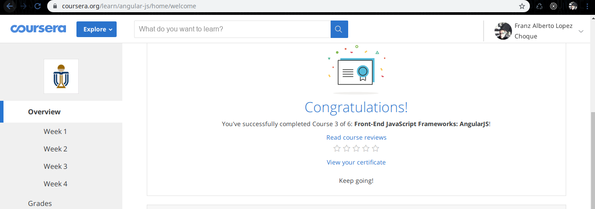
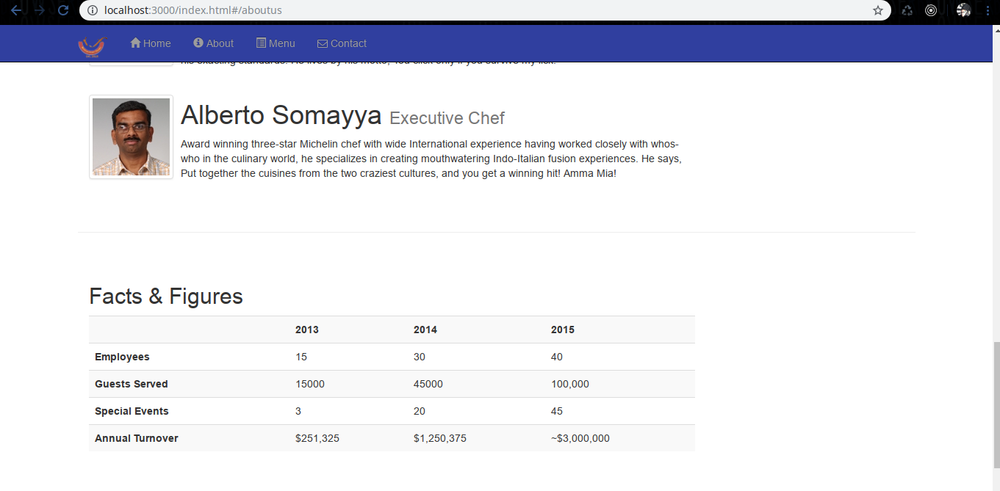
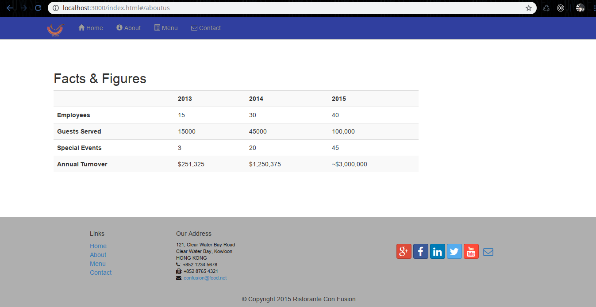
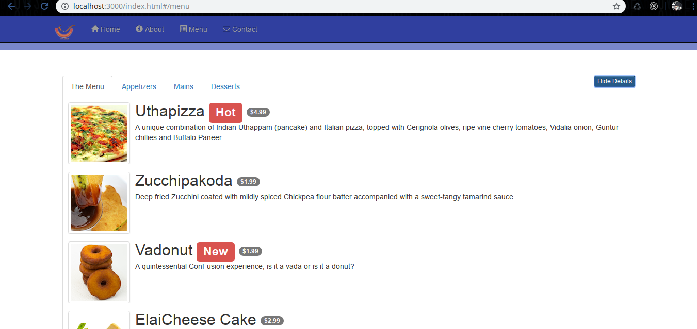
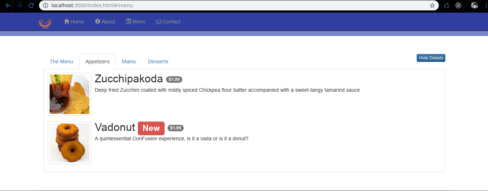
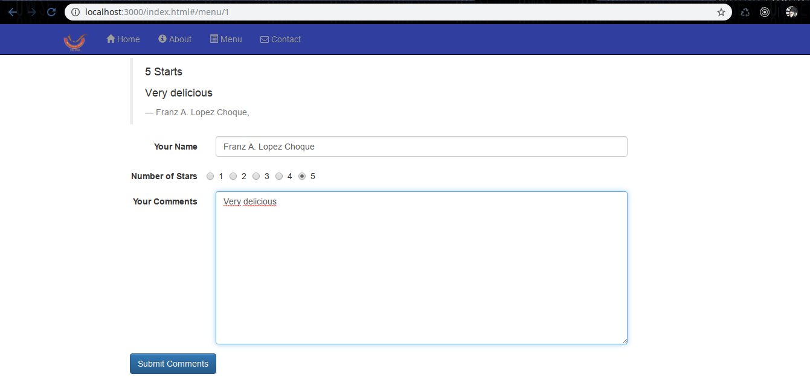
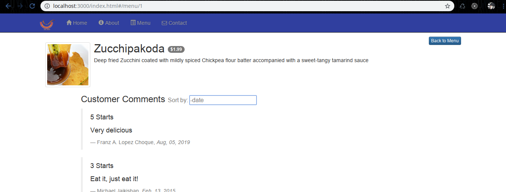

#### Install

```sh
$ npm install
$ npm install gulp@3.9.1 -g
$ npm install json-server -g
$ npm install bower -g
$ bower install
```

#### Gulp 
```sh
$ gulp watch
```
#### Json server
```sh
$ cd json-server
$ json-server --watch db.json --port 3000
``` 

#### Images








